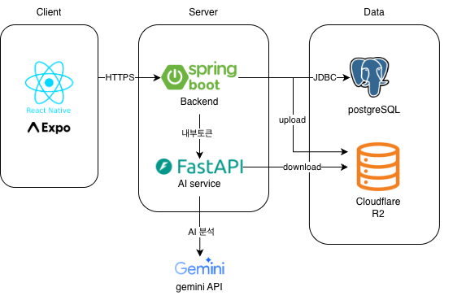
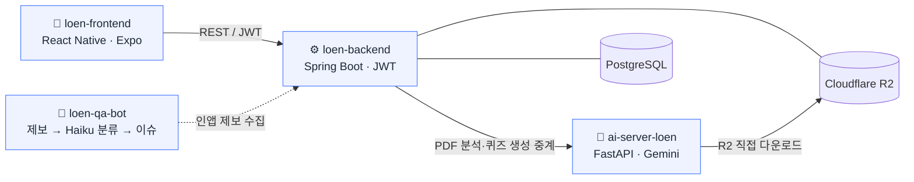

# Loen

**신앙·성경 읽기 모바일 앱** — 말씀 묵상 · OBS 복습 · 신앙노트 · 챌린지를 한 앱에서

📱 **현재 App Store(TestFlight) · Google Play 비공개 테스트로 베타 운영 중**

---

## What is Loen

Loen은 교회 공동체의 신앙 생활을 돕는 모바일 앱입니다.
주일 말씀(OBS) 복습, 매일 성경 읽기와 목표 추적, 신앙노트(감사·기도·말씀·염려),
신앙/성경 챌린지, 오이코스(소그룹) 기능을 제공합니다.

기획·설계부터 백엔드·AI 서비스·모바일 앱 구현, 배포 파이프라인과 운영 자동화까지
**전 영역을 직접 설계하고 출시·운영**하고 있는 프로젝트입니다.

## 아키텍처

  
   
  시스템 통신 흐름 — 클라이언트는 백엔드만 호출하고, 백엔드가 AI 서비스를 내부 토큰으로 중계

 

**리포지토리 관계도**

- 백엔드가 AI 서비스 URL을 보유하고 **중계** — 프론트에 AI 서비스를 직접 노출하지 않음
- 파일 업로드는 백엔드가 R2(S3 호환)에 저장, AI 서비스는 R2에서 직접 다운로드
- **환경 = 브랜치**: `dev`는 Raspberry Pi 셀프호스트, `prod`는 Railway — 환경별 시크릿 분리

## 서비스

| Repo | 역할 | 스택 |
|------|------|------|
| [**loen-frontend**](https://github.com/Logos-engineers/loen-frontend) | 모바일 앱 (현재 유일한 출시 대상) | React Native 0.81 · Expo 54 · TypeScript · EAS / OTA |
| [**loen-backend**](https://github.com/Logos-engineers/loen-backend) | 메인 API 서버 | Java 21 · Spring Boot 4 · PostgreSQL · JWT · R2 |
| [**ai-server-loen**](https://github.com/Logos-engineers/ai-server-loen) | PDF 분석 + 퀴즈 자동 생성 | Python 3.12 · FastAPI · Google Gemini |
| [**loen-qa-bot**](https://github.com/Logos-engineers/loen-qa-bot) | QA 제보 자동 분류 봇 | 인앱 제보 → Claude Haiku 분류 → GitHub 이슈 |

## 엔지니어링 하이라이트

- **🌐 멀티환경 토폴로지** — `브랜치 = 환경`으로 dev(Raspberry Pi) / prod(Railway)를 분리하고,
  환경별 시크릿·OAuth 클라이언트·앱 식별자(`com.loen.app.dev`)까지 공존시켜 안전하게 검증
- **🤖 AI 파이프라인** — PDF를 규칙 기반으로 파싱한 뒤 Gemini로 구조만 후보정(`section_refiner`),
  실패 시 규칙 결과로 폴백하는 **하이브리드 설계**로 LLM 비결정성을 통제
- **🚀 OTA 배포** — EAS Update로 JS 변경은 즉시 무중단 반영하고, 네이티브 변경만 새 빌드로 분리
- **🔐 인증 보안** — Google OAuth + 이메일 가입, rate limiting · brute-force 방어 ·
  refresh 토큰 회전(race condition) 처리
- **⚙️ 운영 자동화** — 인앱 제보를 Haiku가 분류해 GitHub 이슈로 적재하고,
  라벨 상태머신 기반 triage → fix 파이프라인으로 디버그 루프를 반자동화
- **📊 행동 분석** — 핵심 사용자 이벤트(성경·OBS·노트)를 서버에서 집계해 대시보드로 모니터링

---

Logos Engineers · Loen Project

